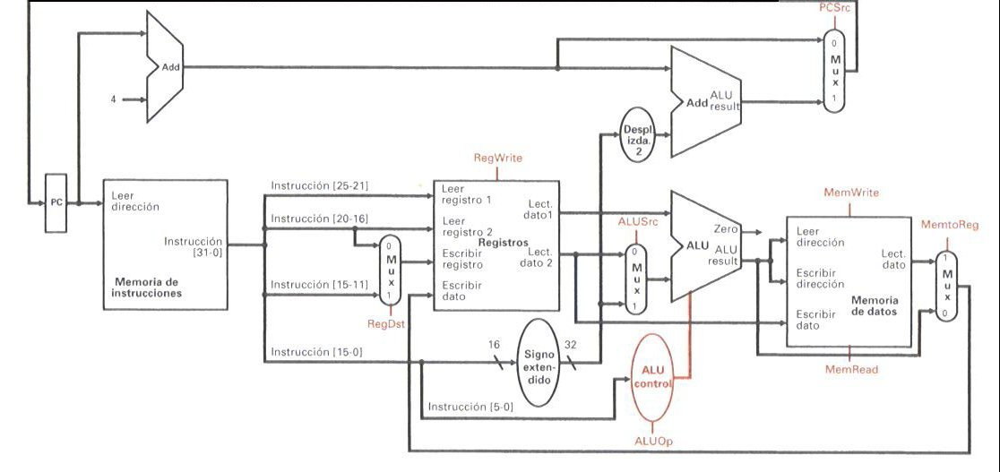

# Procesador-Uniciclo
Proyecto 2 del Curso de Diseño de Sistemas Digitales

El siguiente proyecto está desarrollado en SystemVerilog y tiene como objetivo implementar un procesador uniciclo basado en la arquitectura RISC-V RV32I.

  

Estudiante: Fabián Parreaguirre Hidalgo
